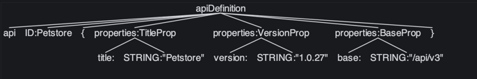

# Week 1

## Progress: 

- Getting to know ANTLR:
  - https://www.antlr.org
    - Setting up a basic lexer - parser with ANTLR
    - Simple api def language:
    ```rsdl
      api Petstore {
        title: "Petstore"
        version: "1.0.27"
        base: "/api/v3"
      }
      ```
    - Parse tree:
    
- Ideation of my Rest-DSL's core concepts:
  - Separate resources and actions - a service can support both
    - Resources: (GET, PUT etc.) CRUD support (== NOUNS e.g: "/pet")
      - Add possibility to customization
        - what is the key when "/pet/{key}"
        - readonly fields (cannot be updated)
        - writeonly fields (cannot be read once created)
      - Or which operations is supported
        - create one (POST /pet) - create;
        - find by id (GET /pet/1) - get;
        - list all (GET /pet) - list;
        - update whole (PUT /pet/1) - update;
        - update partly (PATCH /pet/1) - change;
        - delete one (DELETE /pet/1) - delete;
    - Actions: defaults to POSTs (== VERBS e.g:"/buy")
      - customization
        - change http method
        - body / query params?
  - Researching other similar designs: OAS and Smithy
    - https://smithy.io/2.0/index.html
    - https://swagger.io/specification/

## Plan for next weeks:

- Extend language support:
  - simple model support without extension or inheritance
  - simple resource support without customization
  - simple operation support without customization
- Create more examples (with tests) for input - output
- Create generator for
  - server(java)
  - client(java)
  - oas structure
